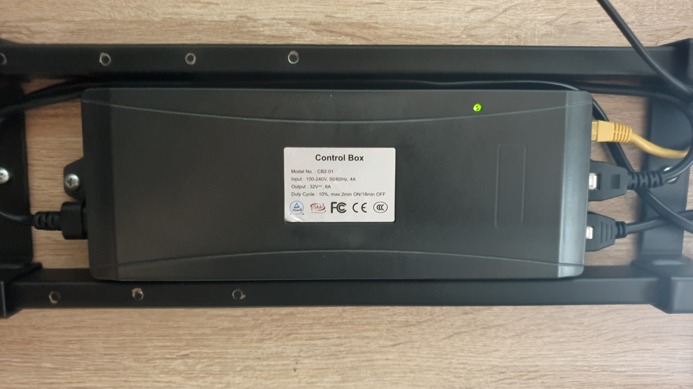
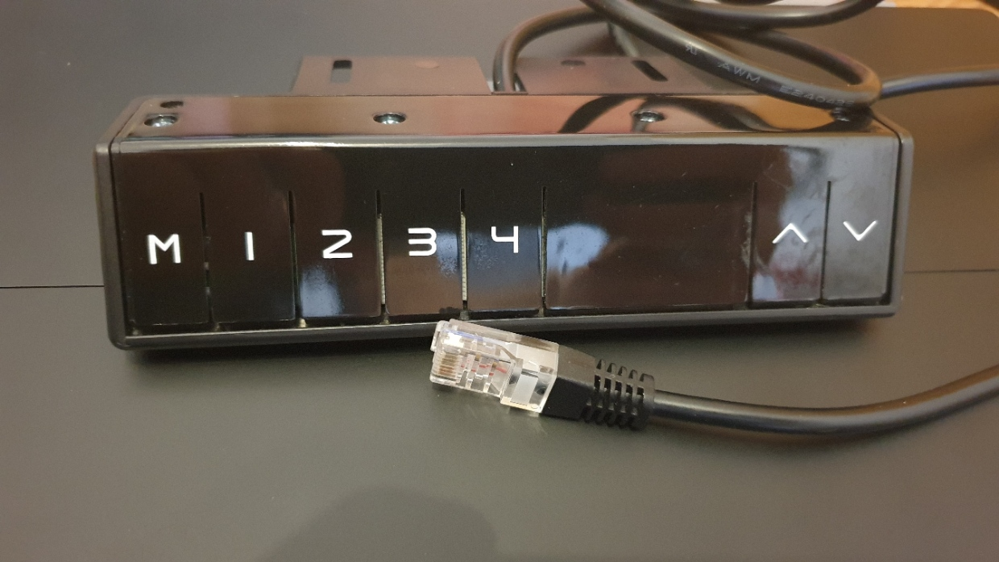

# ESPHomeGenericSitStandDesk

I have one of those generic relatively cheap Sit Stand Desks. In an effort to monitor my desk usage I developed this overkill solution for integrating the desk into a smart home like [Home Assistant](https://www.home-assistant.io/).

In addition to reporting the height, the ESP can also send commands to activate saved memory profiles or move the desk manually.

This is a custom Component for [ESPHome](https://esphome.io/) based on the [ESPHome UART Bus](https://esphome.io/components/uart.html).

## Requirements

- a compatible Standing Desk (so far only my desk has been tested)
- ESPHome 2021.12.0 or higher
- Home Assistant Core 2021.12 or higher

## Usage

- Clone this repo
- Copy the components you need from [desk.yaml](desk.yaml)

```yaml
- platform: custom
  lambda: |-
    auto desk_sensor = new UartDeskSensor(id(uart_bus), <base height>, <correction factor>);
    App.register_component(desk_sensor);
    return {desk_sensor->desk_height, desk_sensor->desk_is_moving};
```
- replace `<base height>` with your desks lowest desk height
- (optional) replace `<correction factor (optional)>` with a correction factor, otherwise remove this part
- Install and run on a ESP of your choice

An example configuration can be found [here](desk.yaml).

## Entities
This Component can provide the following entities:

**Controls:**
- M1
- M2 
- M3
- M4
- Up
- Down

**Sensors:**
- height
- is moving


## Wiring

On my particular model the Handset is connected via a RJ-45 connector. 

Control Box|Handset
:-:|:-:
|  

The ESP is connected according to this wiring diagram. It replaces the Handset.

```
ESP             RJ-45 (T-568B)   Control Box
            1 (Orange/White)    - 
            2 (Orange)          -
VIN ------- 3 (Green/White)     - 5V
            4 (Blue)            -
            5 (Blue/White)      -
GND ------- 6 (Green)           - GND
TX  ------- 7 (Brown/White)     - RX
RX  ------- 8 (Brown)           - TX
```
Be aware that most ESPs run on 3.3v!


## Communication
For information regarding the communication between the Controller and Handset look [here](communication.md). 

